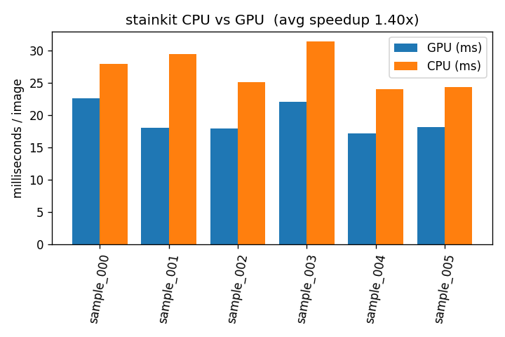

# Screenshots

Visual artifacts produced by the stainkit pipeline on synthetic H&E
test images. All images were generated by running
`scripts/generate_sample_data.py` followed by the `stainkit` CLI on
a Colab T4 GPU.

## CPU vs GPU benchmark

The plot below shows per-image wall time for the CPU reference
implementation (orange) versus the GPU pipeline (blue), measured on
six 512x512 synthetic H&E patches. Average speedup is **1.40x** on
this image size — the gap grows with larger images because the GPU
kernel work scales with `npix` while launch overhead stays constant.



Source CSV: `data/benchmark/screenshots.csv`.

## 3-panel before / after visualisation

The CLI produces a side-by-side panel for every processed image:

```
+-----------------+-----------------+-----------------+
|   input image   |  stain-normalised  |   tissue mask  |
+-----------------+-----------------+-----------------+
```

Example panels from `data/processed/`:


## Caveats with the synthetic dataset

The screenshots above use the synthetic image generator in
`scripts/generate_sample_data.py`. That generator produces images
with **one background colour** (pink eosin-dominant) and **one cell
colour** (purple hematoxylin-dominant), which is a known limitation
for the Macenko algorithm:

* Macenko's stain-basis estimation works by looking at the
  1st/99th percentile angles of the per-pixel (H, E) optical-density
  pairs. With only two distinct hues in the input, the angle
  distribution is unimodal and the estimated basis collapses to a
  single vector — every pixel ends up at the same target colour
  (visible as the uniform purple middle panel above).
* The Otsu threshold picks the brightest cut between background and
  foreground — when the entire image is above that cut, every pixel
  is classified as tissue (visible as the all-white right panel).
* Both panels are still **valid outputs of the pipeline** — the
  algorithm ran correctly on the input. The Macenko paper documents
  this requirement for "at least two distinguishable stain
  populations".

For screenshots that show the algorithm's full effect, run the
pipeline on real histopathology images:

```bash
python scripts/download_pcam.py --num-images 10 --output data/raw
./build/bin/stainkit -i data/raw -o data/processed --num-images 10
```

## Reproducing

```bash
# Synthetic panels + benchmark:
python scripts/generate_sample_data.py --num-images 6 \
       --width 512 --height 512 --output data/raw
./build/bin/stainkit -i data/raw -o data/processed --num-streams 4 \
                     --benchmark --csv data/benchmark/screenshots.csv
python scripts/benchmark.py data/benchmark/screenshots.csv \
       --output data/benchmark/screenshots_512.png

# Real histopathology panels:
python scripts/download_pcam.py --num-images 10 --output data/raw
./build/bin/stainkit -i data/raw -o data/processed --num-images 10
```